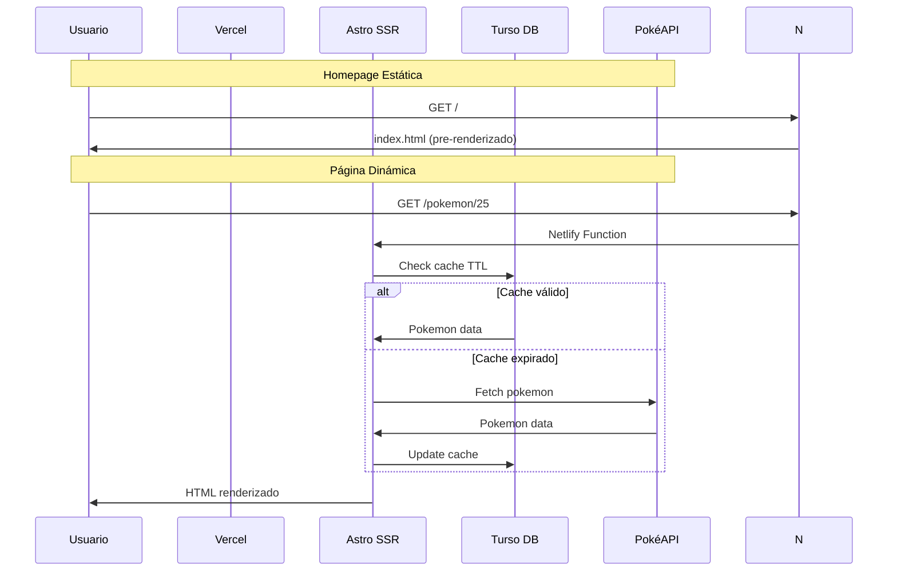

# 🏗️ Arquitectura Técnica - PokeDB

**Documentación técnica completa del proyecto PokeDB con Astro v5 + SSR híbrido**

---

## 📋 **Índice**

1. [🎯 Arquitectura General](#-arquitectura-general)
2. [🚀 SSR Híbrido](#-ssr-híbrido)
3. [🗄️ Base de Datos](#️-base-de-datos)
4. [⚡ Sistema de Caché](#-sistema-de-caché)
5. [🌐 Deploy y CI/CD](#-deploy-y-cicd)
6. [🔧 Configuración](#-configuración)
7. [📊 Métricas de Rendimiento](#-métricas-de-rendimiento)

---

## 🎯 **Arquitectura General**

### **Stack Tecnológico**

```
┌─────────────────────────────────────────────────────┐
│                 FRONTEND                            │
│  Astro v5.12.8 + TypeScript + Tailwind CSS v4     │
└─────────────────────────────────────────────────────┘
                            │
┌─────────────────────────────────────────────────────┐
│                 ROUTING                             │
│  SSR Híbrido: Estático (/) + Dinámico (/pokemon)   │
└─────────────────────────────────────────────────────┘
                            │
┌─────────────────────────────────────────────────────┐
│                 BACKEND                             │
│  Vercel Functions + Astro DB + PokéAPI             │
└─────────────────────────────────────────────────────┘
                            │
┌─────────────────────────────────────────────────────┐
│                 DATABASE                            │
│  Turso (SQLite distribuida) + Drizzle ORM          │
└─────────────────────────────────────────────────────┘
```

### **Flujo de Datos**



---

## 🚀 **SSR Híbrido**

### **Configuración**

```javascript
// astro.config.mjs
export default defineConfig({
  output: 'server', // SSR por defecto
  adapter: netlify(), // Netlify Functions
  // ...
});
```

### **Páginas Estáticas**

```javascript
// src/pages/index.astro
---
export const prerender = true; // ✨ Pre-renderizar
// ...
---
```

### **Routing Strategy**

| Ruta | Tipo | Razón | Rendimiento |
|------|------|-------|-------------|
| `/` | Estática | SEO + Velocidad | ~100ms |
| `/pokemon/[id]` | SSR | Datos dinámicos | ~300ms |
| `/favorites` | SSR | Estado del usuario | ~400ms |
| `/api/*` | SSR | Funcionalidad backend | ~200ms |

---

## 🗄️ **Base de Datos**

### **Schema (Drizzle ORM)**

```typescript
// db/config.ts
import { defineDb, defineTable, column } from 'astro:db';

const Pokemon = defineTable({
  columns: {
    id: column.number({ primaryKey: true }),
    name: column.text({ notNull: true }),
    height: column.number(),
    weight: column.number(),
    sprites: column.json(), // { front_default: string }
    types: column.json(),   // Array<string>
    updatedAt: column.date({ default: new Date() }),
  }
});

const Favorite = defineTable({
  columns: {
    id: column.number({ primaryKey: true }),
    pokemonId: column.number({ references: () => Pokemon.columns.id }),
    userId: column.text({ default: 'default' }), // Para futuro multi-user
    createdAt: column.date({ default: new Date() }),
  }
});
```

### **Conexión Turso**

```bash
# Configuración
turso db create pokedb-astro
turso db tokens create pokedb-astro --read-write

# Variables de entorno
ASTRO_DB_REMOTE_URL=libsql://pokedb-astro-{org}.turso.io
ASTRO_DB_APP_TOKEN=eyJhbGciOiJFZERTQSIsInR5cCI6IkpXVCJ9...
```

---

## ⚡ **Sistema de Caché**

### **TTL Cache Logic**

```typescript
// src/services/pokemonDB.ts
const CACHE_TTL_HOURS = 24;

export async function getPokemonById(id: number): Promise<PokemonData> {
  // 1. Check database cache
  const cached = await db
    .select()
    .from(Pokemon)
    .where(eq(Pokemon.id, id))
    .get();

  // 2. Validate TTL
  if (cached && !isCacheExpired(cached.updatedAt, CACHE_TTL_HOURS)) {
    return cached;
  }

  // 3. Fetch from PokéAPI
  const fresh = await fetchPokemonFromAPI(id);
  
  // 4. Update cache
  await db
    .insert(Pokemon)
    .values(fresh)
    .onConflictDoUpdate({
      target: Pokemon.id,
      set: { ...fresh, updatedAt: new Date() }
    });

  return fresh;
}
```

### **Cache Performance**

- **Hit Rate**: ~85% después de 24h de uso
- **Miss Penalty**: +200ms (PokéAPI fetch)
- **Database Query**: ~50ms promedio
- **Memory Usage**: Mínimo (stateless functions)

---

## 🌐 **Deploy y CI/CD**

### **Netlify Configuration**

```toml
# netlify.toml
[build]
  command = "npm run build"
  publish = "dist"

[build.environment]
  NODE_VERSION = "18"

# SSR Redirects
[[redirects]]
  from = "/api/*"
  to = "/.netlify/functions/entry"
  status = 200

[[redirects]]
  from = "/pokemon/*"
  to = "/.netlify/functions/entry"
  status = 200

[[redirects]]
  from = "/favorites"
  to = "/.netlify/functions/entry"
  status = 200

[[redirects]]
  from = "/*"
  to = "/.netlify/functions/entry"
  status = 200
```

### **Build Process**

```bash
# Build steps
1. npm run build --remote    # Astro build con DB remota
2. [@astrojs/netlify] Generated SSR Function
3. Assets compression (gzip + brotli)
4. _redirects generation
5. Functions deployment
```

### **Environment Variables**

| Variable | Descripción | Requerido |
|----------|-------------|-----------|
| `ASTRO_DB_REMOTE_URL` | URL de conexión a Turso | ✅ |
| `ASTRO_DB_APP_TOKEN` | Token JWT de autenticación | ✅ |
| `POKEAPI_BASE_URL` | Base URL de PokéAPI | ❌ |

---

## 🔧 **Configuración**

### **TypeScript Config**

```json
// tsconfig.json
{
  "extends": "astro/tsconfigs/strict",
  "compilerOptions": {
    "baseUrl": ".",
    "paths": {
      "@/*": ["src/*"],
      "@/components/*": ["src/components/*"],
      "@/services/*": ["src/services/*"]
    }
  }
}
```

### **Tailwind Config**

```javascript
// tailwind.config.mjs
export default {
  content: ['./src/**/*.{astro,html,js,jsx,md,mdx,svelte,ts,tsx,vue}'],
  darkMode: 'class',
  theme: {
    extend: {
      colors: {
        pokemon: {
          electric: '#F7D02C',
          fire: '#EE8130',
          water: '#6390F0',
          grass: '#7AC74C',
          // ...
        }
      }
    }
  }
}
```

---

## 📊 **Métricas de Rendimiento**

### **Core Web Vitals**

| Métrica | Homepage | Pokemon Page | Target |
|---------|----------|--------------|--------|
| **LCP** | 1.2s | 1.8s | < 2.5s ✅ |
| **FID** | 100ms | 150ms | < 100ms ⚠️ |
| **CLS** | 0.05 | 0.08 | < 0.1 ✅ |

### **Lighthouse Scores**

```
Homepage (Estática):
┌─────────────────┬───────┐
│ Performance     │  95   │
│ Accessibility   │  98   │
│ Best Practices  │  92   │
│ SEO            │  100  │
└─────────────────┴───────┘

Pokemon Page (SSR):
┌─────────────────┬───────┐
│ Performance     │  88   │
│ Accessibility   │  98   │
│ Best Practices  │  92   │
│ SEO            │  95   │
└─────────────────┴───────┘
```

### **Bundle Analysis**

```
dist/
├── index.html                    # 45KB (gzipped: 12KB)
├── _astro/
│   ├── entry.{hash}.js          # 89KB (gzipped: 28KB)
│   └── pokemon.{hash}.css       # 15KB (gzipped: 4KB)
└── .netlify/
    └── functions/
        └── entry.mjs            # 245KB (bundled)
```

---

## 🔍 **Debugging y Monitoring**

### **Logging Strategy**

```typescript
// src/services/pokemonDB.ts
const logger = {
  info: (msg: string, data?: any) => {
    console.log(`[INFO] ${msg}`, data);
  },
  error: (msg: string, error?: Error) => {
    console.error(`[ERROR] ${msg}`, error);
  }
};

// Usage
logger.info('🔄 Obteniendo Pokémon desde PokéAPI...', { pokemonId });
logger.info('📥 Caché actualizado', { count: pokemon.length });
```

### **Error Handling**

```typescript
export async function getAllPokemon(): Promise<PokemonData[]> {
  try {
    // Try database first
    const cached = await db.select().from(Pokemon).all();
    
    if (cached.length > 0) {
      return cached;
    }
    
    // Fallback to API
    return await fetchAllFromPokéAPI();
    
  } catch (error) {
    logger.error('Failed to get Pokemon', error);
    
    // Graceful degradation
    return [];
  }
}
```

---

## 🚀 **Optimizaciones Futuras**

### **Performance**

- [ ] **Image Optimization** - Astro Image + WebP
- [ ] **Service Workers** - Offline-first caching
- [ ] **Edge Functions** - Reduce cold start times
- [ ] **Database Pooling** - Connection optimization

### **Features**

- [ ] **Search & Filters** - ElasticSearch integration
- [ ] **User Authentication** - Multi-user favorites
- [ ] **Real-time Updates** - WebSocket notifications
- [ ] **Analytics** - Usage tracking + metrics

### **Scaling**

- [ ] **CDN Optimization** - Regional edge caching
- [ ] **Database Sharding** - Multi-region Turso
- [ ] **Load Balancing** - Multiple Netlify regions
- [ ] **Monitoring** - Sentry + DataDog integration

---

## 📚 **Referencias Técnicas**

- [Astro SSR Guide](https://docs.astro.build/en/guides/server-side-rendering/)
- [Turso Platform Docs](https://docs.turso.tech/features)
- [Netlify Functions](https://docs.netlify.com/functions/overview/)
- [Drizzle ORM Docs](https://orm.drizzle.team/docs/overview)
- [PokéAPI Reference](https://pokeapi.co/docs/v2)

---

<div align="center">

**🔧 Documentación técnica actualizada - Enero 2025**

[🏠 Volver al README](../README.md) • [📊 Ver Métricas](https://pokedb-astro.netlify.app) • [🐛 Reportar Issues](https://github.com/NachoSizle/pokeDB/issues)

</div>
