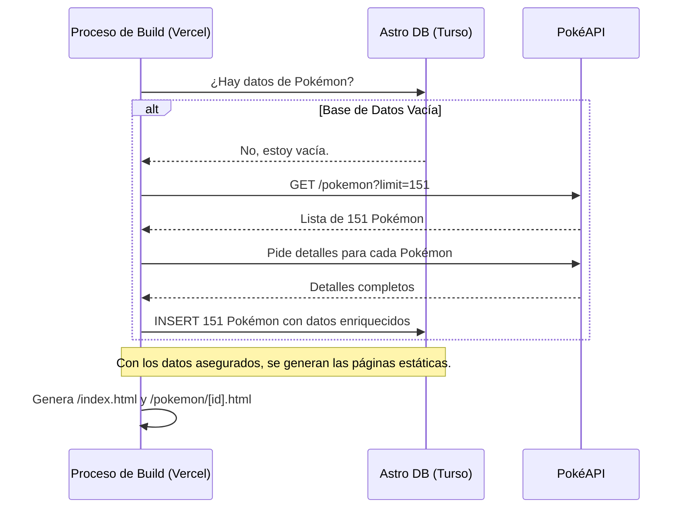

# 🏗️ Arquitectura Técnica - PokeDB

**Documentación técnica completa del proyecto PokeDB con Astro, siguiendo una arquitectura híbrida optimizada para rendimiento y escalabilidad.**

---

## 📋 **Índice**

1. [🎯 Arquitectura General](#-arquitectura-general)
2. [🚀 Modelo Híbrido (SSG/SSR)](#-modelo-híbrido-ssgssr)
3. [🏝️ Islas de Interactividad con SolidJS](#️-islas-de-interactividad-con-solidjs)
4. [🗄️ Base de Datos y Flujo de Datos](#️-base-de-datos-y-flujo-de-datos)
5. [🌐 Deploy y CI/CD con Vercel](#-deploy-y-cicd-con-vercel)

---

## 🎯 **Arquitectura General**

### **Stack Tecnológico**

```
┌─────────────────────────────────────────────────────┐
│                 FRONTEND                            │
│  Astro v5+ + SolidJS + TypeScript + Tailwind CSS    │
└─────────────────────────────────────────────────────┘
                            │
┌─────────────────────────────────────────────────────┐
│                 ROUTING                             │
│  Modelo Híbrido: SSG (páginas estáticas) + SSR      │
└─────────────────────────────────────────────────────┘
                            │
┌─────────────────────────────────────────────────────┐
│                 BACKEND & BUILD                     │
│  Vercel Functions + Astro DB + PokéAPI             │
└─────────────────────────────────────────────────────┘
                            │
┌─────────────────────────────────────────────────────┐
│                 DATABASE                            │
│  Turso (SQLite distribuida) + Drizzle ORM          │
└─────────────────────────────────────────────────────┘
```

---

## 🚀 **Modelo Híbrido (SSG/SSR)**

La clave de la arquitectura de PokeDB es el **modelo híbrido** de Astro, que nos permite decidir el modo de renderizado por página para un rendimiento óptimo.

### **Estrategia de Renderizado por Ruta**

| Ruta              | Modo de Renderizado | Razón de la Elección                                                                    |
|-------------------|---------------------|-----------------------------------------------------------------------------------------|
| `/`               | **SSG** (Estática)  | Página principal, contenido idéntico para todos. Se pre-renderiza para máxima velocidad y SEO. |
| `/pokemon/[id]`   | **SSG** (Estática)  | Los detalles de los 151 Pokémon son fijos. Se generan 151 páginas HTML en el `build`.   |

| `/api/*`          | **SSR** (Servidor)  | Endpoints de API que necesitan ejecutarse en el servidor para interactuar con la DB.     |

---

## 🏝️ **Islas de Interactividad con SolidJS**

Para añadir interactividad a nuestras páginas estáticas (SSG) sin sacrificar el rendimiento, utilizamos el concepto de **Islas de Astro** con SolidJS.

### **Caso de Uso: Botón Dinámico**

La página de detalles de un Pokémon (`/pokemon/[id]`) es estática, pero algunos elementos necesitan ser dinámicos. 

1.  **Componente Interactivo**: Se crea un componente en SolidJS (`DynamicButton.jsx`) que maneja su propio estado y lógica.
2.  **Carga en el Cliente**: Se integra en la página `.astro` con una directiva `client:*`, que le dice a Astro que envíe el JavaScript de este componente al navegador.

```astro
// src/pages/pokemon/[id].astro
---
import DynamicButton from '../../components/DynamicButton.jsx';
const { pokemon } } = Astro.props;
---
<!-- El resto de la página es HTML estático... -->

<!-- ...excepto esta isla de SolidJS -->
<DynamicButton 
  client:load 
  pokemonId={pokemon.id} 
/>
```

La directiva `client:load` hidrata el componente tan pronto como la página se carga, haciéndolo interactivo. Esto nos permite tener páginas ultrarrápidas con pequeñas áreas de funcionalidad dinámica, combinando lo mejor de SSG y JavaScript en el cliente.

---

## 🗄️ **Base de Datos y Flujo de Datos**

### **Schema de la Base de Datos (`db/config.ts`)**

El esquema se ha diseñado para almacenar toda la información necesaria de los Pokémon, evitando llamadas futuras a la API externa.

```typescript
// db/config.ts
export const Pokemon = defineTable({
  columns: {
    id: column.number({ primaryKey: true }),
    name: column.text(),
    sprite: column.text(),
    types: column.json(), // Almacena un array de strings
    stats: column.json(), // Almacena un objeto con las estadísticas
    updatedAt: column.date(),
  }
});
```

### **Flujo de Datos en el `Build`**

El problema de los errores 500 se solucionó moviendo toda la carga de datos al proceso de `build`.



---

## 🌐 **Deploy y CI/CD con Vercel**

El proyecto está configurado para un despliegue "zero-config" en Vercel. Cuando se realizan cambios en el esquema de la base de datos, es necesario sincronizarlo con el siguiente comando:

```bash
# ¡Usar con cuidado! Borra la DB y la recrea desde cero.
bunx astro db push --force-reset
```
